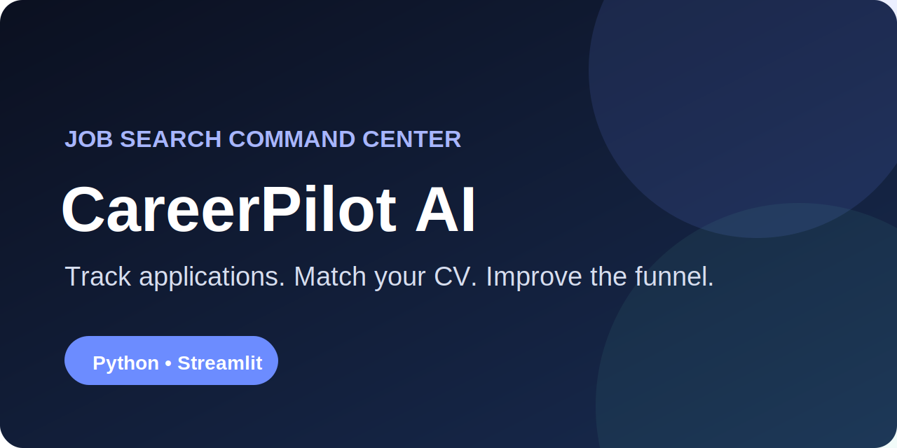
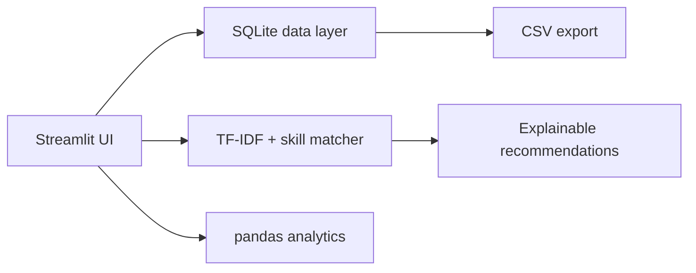

# CareerPilot AI 🎯

<p align="center">
  
</p>

A local-first **job application tracker and explainable CV match analyzer** built with Python, Streamlit, SQLite, pandas, Plotly, and scikit-learn.

> Built by **Fahim Sikder** as a portfolio project to demonstrate product thinking, Python engineering, database design, NLP fundamentals, testing, and deployment.

[](https://github.com/Fahimxbd/careerpilot-ai/actions/workflows/ci.yml)
[](https://www.python.org/)
[](https://streamlit.io/)
[](LICENSE)

## Why this project exists

Job seekers often track roles in scattered notes, forget follow-ups, and send one generic CV everywhere. CareerPilot AI puts the workflow in one place:

- Track every application and its next action
- See the pipeline and response-rate metrics
- Compare a CV with a job description locally
- Identify matched and missing skills
- Export the full application history to CSV

No paid API. No secret key. No user data sent to an external model.

## Features

### Application command center
- Add, edit, search, filter, and delete applications
- Track status, priority, deadline, source, CV version, match score, and contact details
- Export a timestamped CSV backup
- Seed realistic demo data with one click

### Explainable CV Match Lab
- TF-IDF text vectorization
- Cosine similarity
- Deterministic skill extraction and alias handling
- Matched skills, missing skills, and actionable recommendations
- Score breakdown instead of a black-box number

### Analytics
- Active pipeline, interviews, offers, average match, and response rate
- Status distribution and weekly application activity
- Match-score comparison by pipeline stage
- Source-performance table to identify high-yield channels

### Engineering quality
- Modular `src/` package
- SQLite with parameterized queries
- Input validation
- Unit tests with pytest
- Ruff linting
- GitHub Actions across Python 3.11–3.13
- Docker and Docker Compose
- Architecture, security, contribution, and changelog documentation

## Architecture at a glance



After deployment, add real screenshots to `docs/images/` and link them here. Do not use fabricated UI mockups as proof of a working product.

## Quick start

### 1. Clone

```bash
git clone https://github.com/Fahimxbd/careerpilot-ai.git
cd careerpilot-ai
```

### 2. Create a virtual environment

```bash
python -m venv .venv
```

Activate it:

```bash
# Windows
.venv\Scripts\activate

# macOS/Linux
source .venv/bin/activate
```

### 3. Install and run

```bash
pip install -r requirements.txt
streamlit run app.py
```

Open `http://localhost:8501`.

## Run tests

```bash
pip install -r requirements-dev.txt
ruff check .
pytest
```

## Docker

```bash
docker compose up --build
```

The app will be available at `http://localhost:8501`. Docker Compose uses a named volume so the SQLite data survives container recreation.

## Deploy on Streamlit Community Cloud

1. Push this repository to GitHub.
2. Open Streamlit Community Cloud and create an app.
3. Select the repository and branch.
4. Set the entrypoint to `app.py`.
5. Deploy.

For a public demo, treat the included SQLite storage as temporary. A production multi-user version should use authenticated PostgreSQL storage.

## Matching methodology

The overall score is:

```text
overall = 65% × TF-IDF cosine similarity + 35% × recognized skill coverage
```

This method is reproducible and explainable, but it is **not** an ATS guarantee. Users should tailor wording only when it truthfully reflects their experience.

## Repository structure

```text
careerpilot-ai/
├── app.py
├── src/
│   ├── analytics.py
│   ├── db.py
│   ├── matcher.py
│   └── utils.py
├── tests/
├── data/
├── docs/
├── .github/workflows/ci.yml
├── Dockerfile
├── docker-compose.yml
├── pyproject.toml
└── README.md
```

## Roadmap

- [ ] FastAPI backend and PostgreSQL
- [ ] User authentication
- [ ] Follow-up reminders
- [ ] CV version comparison
- [ ] Configurable skill taxonomy
- [ ] Import from LinkedIn job-save exports
- [ ] Multilingual job-description support

## Portfolio talking points

Use these in interviews, but explain them in your own words:

1. **Problem:** job-search data was fragmented and tailoring was inconsistent.
2. **Tradeoff:** chose local TF-IDF over an LLM API for privacy, cost, speed, and explainability.
3. **Architecture:** separated UI, persistence, matching, analytics, and validation for testability.
4. **Data:** used SQLite for zero-config local use; documented PostgreSQL as the production path.
5. **Quality:** added tests, linting, CI, Docker, documentation, and honest limitations.

## License

MIT — see [LICENSE](LICENSE).
